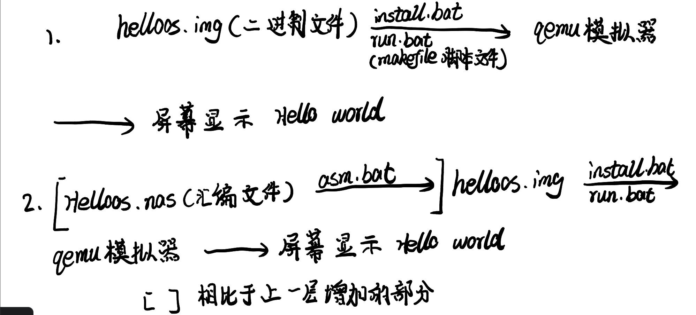
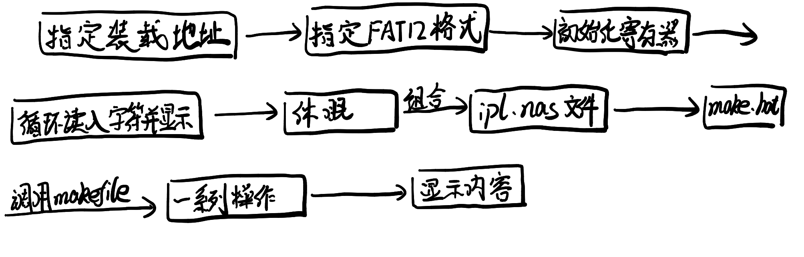

# OSASK--《30天自制操作系统》

这是川合秀实的《30天自制操作系统》的git版本，虽然在GITHUB上看到了有大佬做了(大佬的链接 <https://github.com/Tassandar/OSASK>)，但看了一下感觉不是特别适合我，所以决定自己动手做一个。

## 选择该项目并使用GIT的初衷

这本书是操作系统实验课推荐的一本书，与清华的[UCORE](https://github.com/chyyuu/ucoreosdocs)以及MIT的[xv6](https://github.com/mit-pdos/xv6-public)比起来更简单，更适合上手一点，但根据我看了几天的感受来看也确实忽略了很多东西，准备在看完这本书之后如果有时间再去研究一下那两个系统，几天看下来确实对理解操作系统的原理以及编程的理念有着很大的帮助。

选择GIT管理的理由：这本书随书赠送的光盘中的项目是按照DAY1-30以及每天都会有变化分开文件夹来观看的，讲道理十分适合用GIT的方式进行管理，在跟着书复制粘贴了(bushi)之后觉得从头自己开始跟着书写重新体会一下，并完成这个项目。

本项目链接
<https://github.com/StephenYuan7/OSASK_by_Stephen>

## 进度条

### DAY1

  

### DAY2

  
