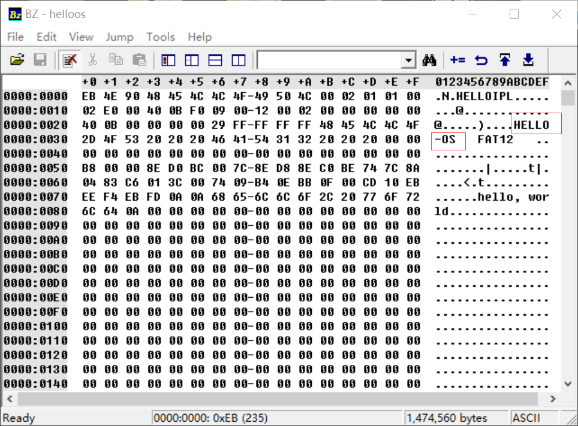
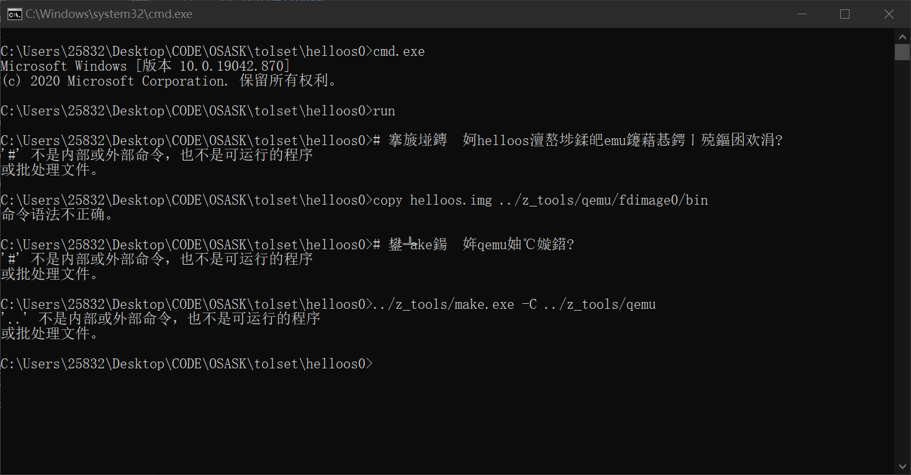
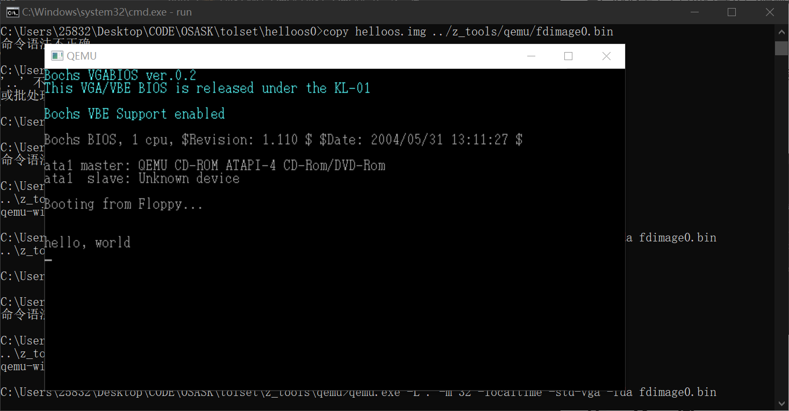

# DAY1

## 添加BZ

BZ是一个二进制编辑器，在前几天会有一定的使用，先添加进项目中，点击BZ文件夹中的BZ.EXE文件进行使用

## 初使用BZ

原文的文件没有说怎么输入，直接把DAY1/helloos0文件夹中的helloos打开,了解了二进制的转换关系(可能是ASCIS码？作者没有说)

## 添加tolset

把光盘中的tolset文件夹添加到项目中，里面有必要的工具比如编译器什么的

## 新建helloos0

在tolset文件夹中新建helloos0，将刚刚打开的helloos复制到该文件夹中

> 注意书中代码有一些问题(项目里没问题)，进行了一些修改和注释

### 新建run.bat

这里用了qemu模拟器来启动
用make启动qemu模拟器
应该是把helloos复制到qemu能启动的文件中

### 新建install.bat

用z_tools某个工具进行导入？(猜测)

### 添加cons两个文件

两个文件用来启动虚拟器，毕竟软盘现在已经很少用了

## 第一次启动尝试

  

失败了

## 第二次尝试

把注释删掉并且把一些左括号右括号改换之后成功
  
