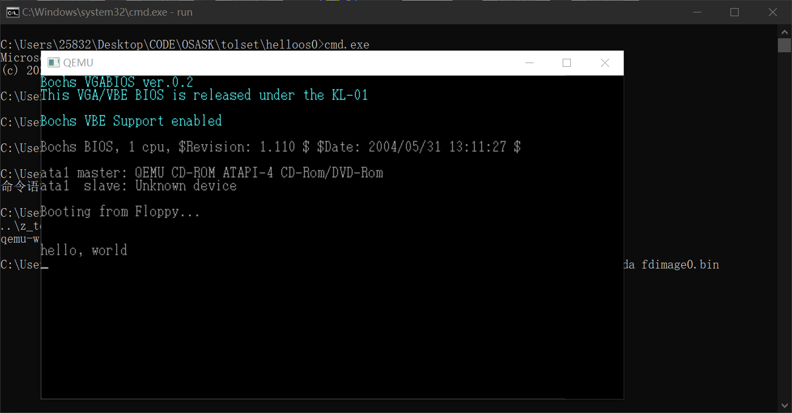
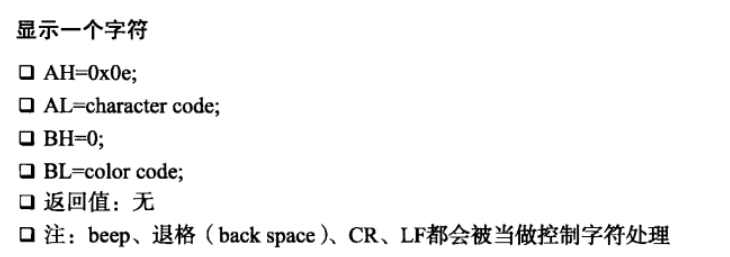
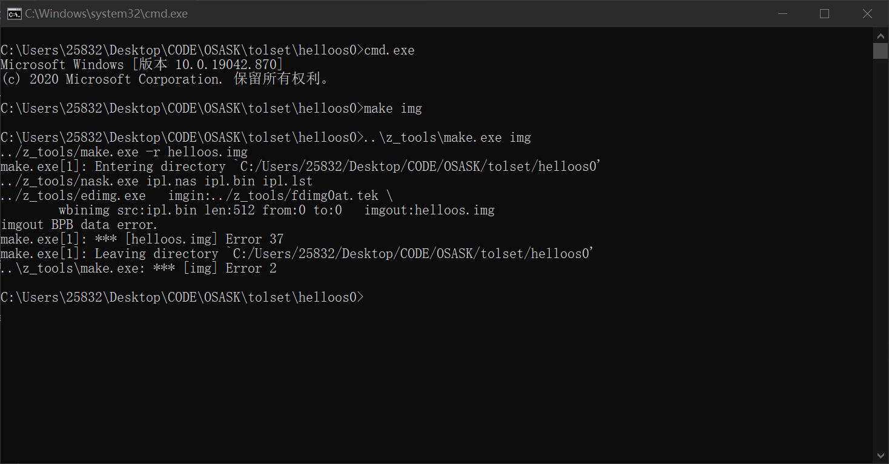
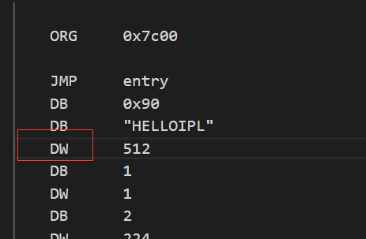
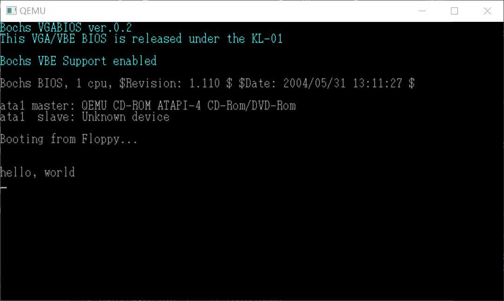
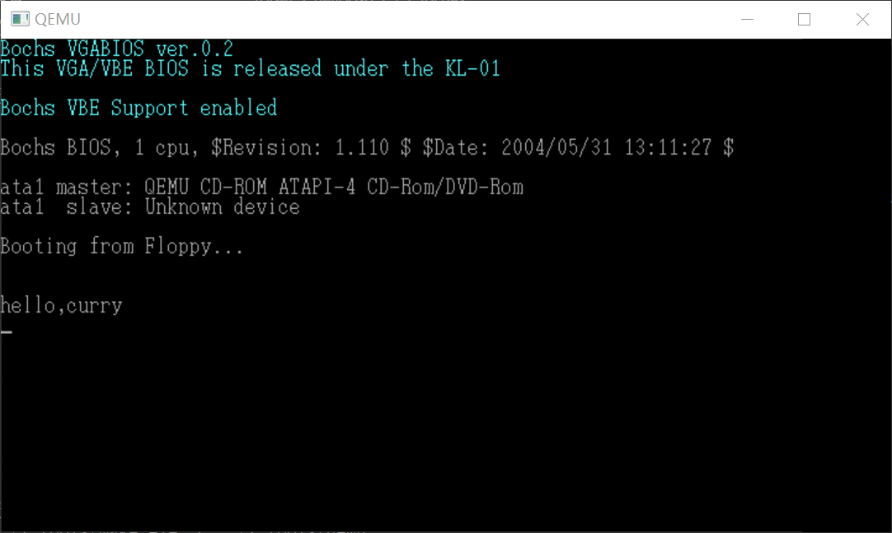

# DAY2

## 手敲helloos.nas的汇编

成功运行
  

## 程序解释

首先开头
`
ORG		0x7c00
`
意为把程序装载到地址为0x7c00的地方(0x是十六进制的意思)，启动区默认是装在0x7c00~0x7dff上，总共512字节(16x16x16/8),一般是把少量代码写在启动区，然后启动区在跳转到真正要运行的代码

接下来
`
JMP		entry
`
无条件跳转到下面entry的地方

后面一大段作者说是指定FAT12格式的地方
```
	DB		0x90
	DB		512
	DB		1
	DW		1
	DB		2
	DW		224
	DW		2880
	DB		0xf0
	DW		9
	DW		18
	DW		2
	DD		0
	DD		2880
	DB		0,0,0x29
	DD		0xffffffff
	DB		"HELLO_OS   "
	DB		"FAT12   "
	RESB	18
```

一开始没搞懂为什么跳转了之后还能指定格式，后来想了一下是这样的，除了第一句 `   ORG	0x7c00   `装载地址会直接运行之外，其他的命令是先进行装入再进行运行的，`JMP		entry`实际上就等于第一天程序中的`DB	0xeb, 0x4e, 0x90`这一句，所以在地址后填在这些配置是能起到设定作用的

接下来entry这一段主要是用来做寄存器的初始化

```
	entry:
			MOV		AX,0
			MOV		SS,AX
			MOV		SP,0x7c00
			MOV		DS,AX
			MOV		ES,AX
			MOV		SI,msg
```

值得注意的是最后一句`MOV		SI,msg`意为把msg的地址传给SI

下面是putloop
```
	putloop:
			MOV		AL,[SI]
			ADD		SI,1
			CMP		AL,0

			JE		fin
			MOV		AH,0x0e
			MOV		BX,15
			INT		0x10
			JMP		putloop
```
首先前面四句，就是依次把msg后面的内容一个字节一个字节传进来，最后传进来0，跳转到fin端进行暂停，如果不是0就依次在屏幕上显示，后面的`MOV		AH,0x0e   MOV		BX,15`是对参数进行设定，参考书上
  
第一句不必多说，第二句同时对两个参数进行设定，因为**BH&BL＝BX(base)：基址寄存器，常用于地址索引**
接下来`INT		0x10`是调用显卡进行显示，`JMP		putloop`则是循环这一段进行调用

下面fin不用过多解释，一个暂停指令
```
	fin:
			HLT
			JMP		fin
```
后面的msg就是输入一下字符，值得注意的是**0x0a**意为换行符，参见ascii码表即可

## mikefile

这一天后面在介绍mikefile，这里就不多介绍了
第一次启动失败
  

仔细对照后发现是这里错了,DW写成了DD
  

成功运行
  

## 开始整活

首先更改显示内容，"hello world"改成"hello, curry"成功
  

刚刚字节一样，现在改成不一样的,"hello world"改成"hello,curry"成功
  

书上说，可以更改颜色，将`MOV		BX,10`
 

然而没有变化
  

